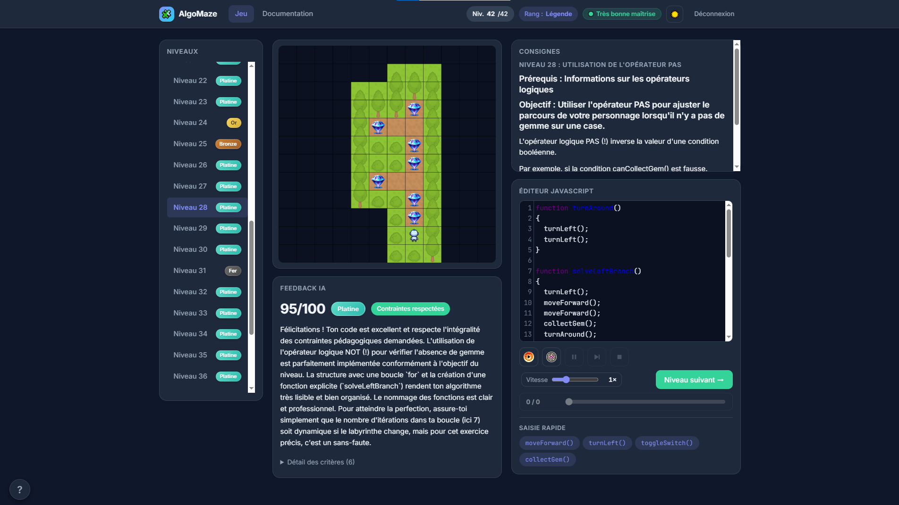
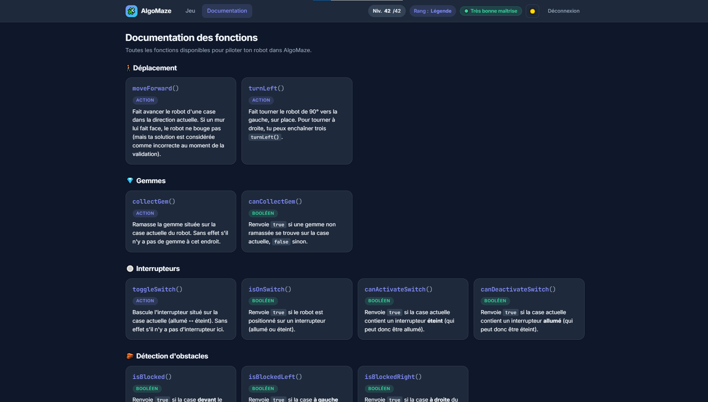
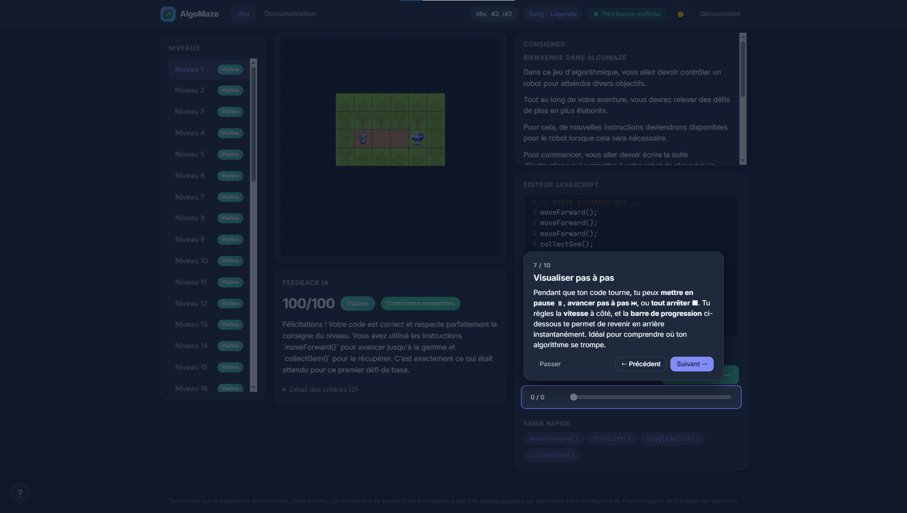
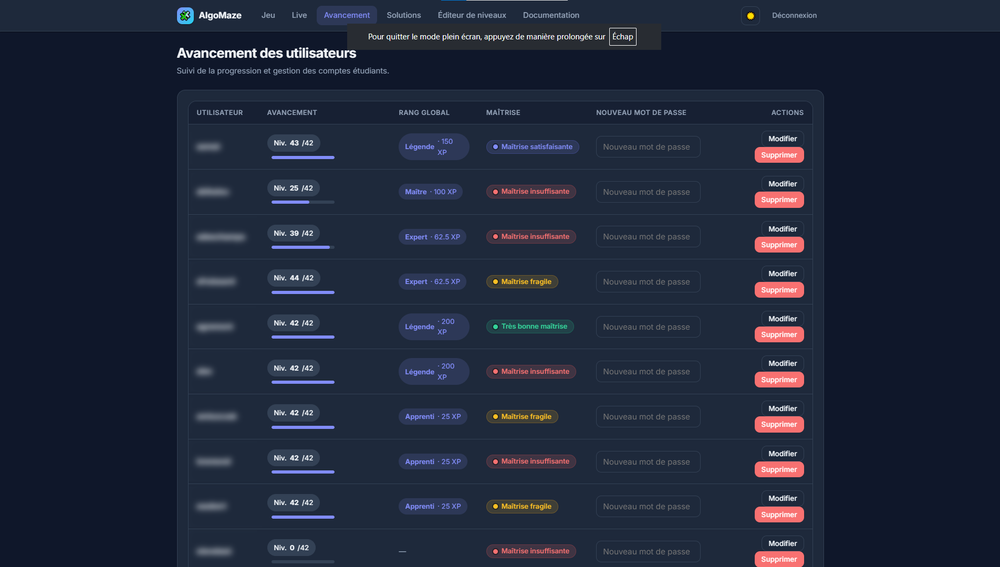
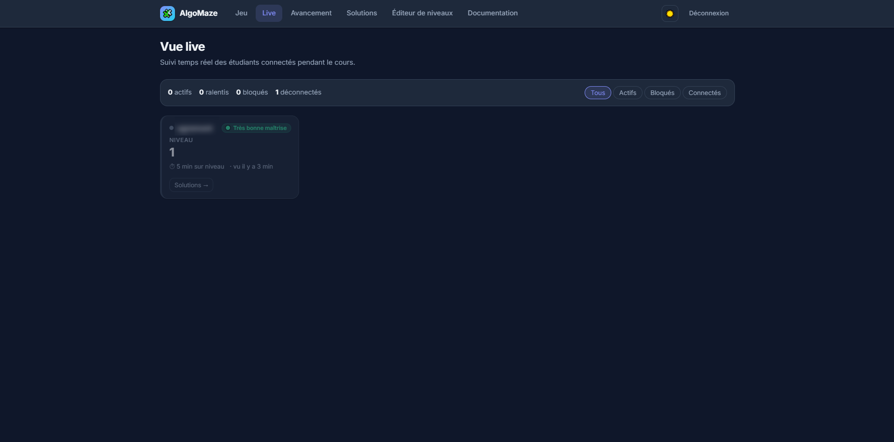
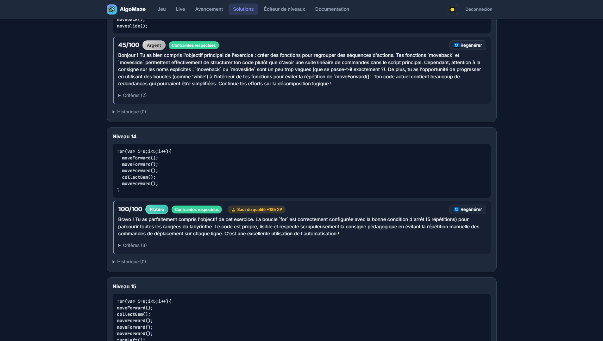
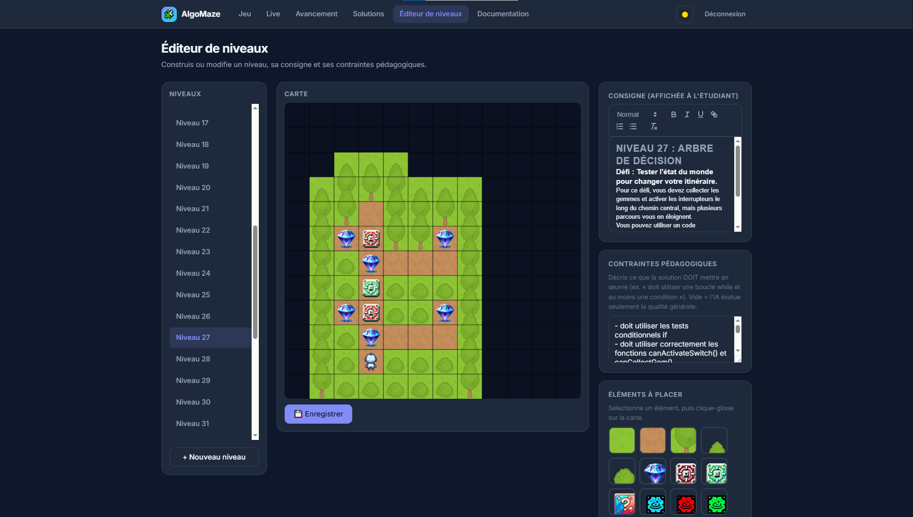
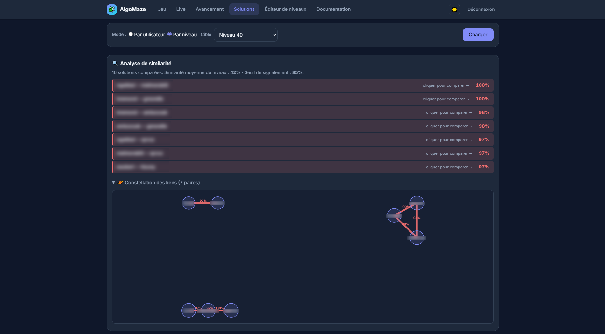

# AlgoMaze

Application web pédagogique pour apprendre l'algorithmique via des puzzles de labyrinthe. Les étudiants écrivent du JavaScript pour piloter un robot, collecter des gemmes, activer des interrupteurs et atteindre la sortie.

Une IA évalue ensuite la qualité de leur code (respect des contraintes pédagogiques, lisibilité), attribue un badge par niveau et calcule un rang global.

## Aperçu

### Côté étudiant

| | |
|:---:|:---:|
|  |  |
| Vue principale du jeu (labyrinthe + éditeur) | Page documentation `/docs` |
|  | |
| Tutoriel interactif au premier lancement | |

### Côté admin / enseignant

| | |
|:---:|:---:|
|  |  |
| Page `/progress` — suivi d'avancement | Page `/live` — classe en temps réel |
|  |  |
| Page `/solutions` — solutions + feedbacks IA | Page `/editor` — édition d'un niveau |
|  | |
| Détection de similarité (constellation + diff) | |

## Fonctionnalités

### Côté étudiant
- 🧩 **Jeu de labyrinthe** : pilote le robot en JavaScript pour collecter des gemmes, activer des interrupteurs et atteindre la sortie.
- ✏️ **Éditeur de code** CodeMirror avec syntaxe JavaScript et fonctions de jeu pré-définies (`moveForward()`, `turnLeft()`, `collectGem()`, `toggleSwitch()`, `isBlocked()`, `isBlockedLeft()`, `isBlockedRight()`, `canCollectGem()`, `isOnSwitch()`, …).
- ▶️ **Visualisateur pas-à-pas** : exécution animée avec pause, reprise et slider de navigation pour comprendre le déroulement d'une solution.
- 🛡️ **Pré-check serveur** avant exécution locale : détecte les boucles infinies pour éviter de freezer le navigateur et sauvegarde le code (historique horodaté des 10 dernières tentatives).
- 🤖 **Évaluation IA** asynchrone via LM Studio (sortie JSON structurée, score + feedback critère par critère), notification temps réel par WebSocket.
- 🏅 **Badges** par niveau (Fer / Bronze / Argent / Or / Platine), **rang global** (Apprenti → Légende) calculé sur la médiane glissante des XP des derniers niveaux, et **niveau de maîtrise** cumulatif combinant avancement et qualité.
- 📖 **Page documentation** `/docs` listant les fonctions du jeu et expliquant le système de progression (badges, rangs, maîtrise).
- 🎯 **Tutoriel interactif** au premier lancement (spotlights et bulles), rappelable à tout moment via le bouton « ? ».
- 🎓 **SSO Moodle** : authentification automatique des étudiants depuis Moodle via une URL signée HMAC (création de compte transparente).
- 🌗 **Thème clair / sombre** avec toggle, design responsive (utilisable sur mobile).

### Côté admin / enseignant
- 🛠️ **Éditeur de niveaux** : édition de la tilemap (murs, cases random), placement des gemmes, interrupteurs, téléporteurs, position de départ, consigne pédagogique et contraintes attendues.
- 📊 **Suivi d'avancement** (`/progress`) : tableau récapitulatif (rang, maîtrise, XP) par étudiant, avec réinitialisation de mot de passe et suppression de compte.
- 🔴 **Dashboard live** (`/live`) : vue temps réel de la classe (qui est connecté, sur quel niveau, signaux suspects).
- 🔍 **Explorateur de solutions** (`/solutions`) : consultation des solutions et feedbacks IA par utilisateur ou par niveau, avec historique horodaté.
- 🚨 **Détection de triche** : capture de signaux comportementaux (collages, temps inactif, pertes de focus, captures d'écran, collages d'images) + détection de **similarité de code** (distance de Levenshtein normalisée) avec constellation et modal de diff côte-à-côte.
- 🤖 **Régénération de feedback IA** : relance unitaire d'une évaluation ou évaluation en masse de toutes les solutions sans feedback (configurable).

### Infrastructure
- 🔐 **Authentification JWT** avec sliding refresh (token renouvelé à 50% du TTL) et synchronisation cookie / localStorage.
- 🚦 **Rate limiting** sur les routes sensibles (login, soumission de solution, pré-check).
- 📡 **WebSocket** (Socket.IO) pour les notifications de feedback IA aux étudiants et la mise à jour temps réel du dashboard admin.
- 🛡️ **Sandbox d'exécution** côté serveur (Node.js VM, timeout 500 ms) pour le pré-check.

## Architecture

```
.
├── server/                       Backend Node.js + Express + Redis
│   ├── index.js                  Routes HTTP, Socket.IO, exécution sandbox
│   ├── routes/user.js            Auth (login/register/logout), gestion utilisateurs, SSO Moodle
│   ├── jwtConfig.js              JWT sliding session (renouvelé à 50% du TTL)
│   ├── rateLimit.js              Rate limiting Redis (login, checkanswer, precheck)
│   ├── feedbackWorker.js         Worker queue Redis robuste (1 job IA à la fois, recovery au crash)
│   ├── llmClient.js              Client LM Studio (response_format json_schema)
│   ├── badges.js                 Mapping score→badge, médiane→rang, score de maîtrise
│   ├── presence.js               Suivi temps réel des étudiants (dashboard /live)
│   ├── cheatDetection.js         Signaux comportementaux + similarité de code (Levenshtein)
│   ├── redisClient.js            Connexion Redis partagée
│   ├── config.json               Config applicative (seuils, rate limits, cheat detection)
│   ├── public/                   Assets statiques
│   │   ├── js/                   algomaze, level-editor, tutorial, app-shell, auth, common
│   │   ├── css/styles.css        Thème clair/sombre, composants UI
│   │   └── assets/               Tilesets et sprites
│   └── *.html                    Pages : login, register, algomaze, docs, level-editor,
│                                 progress, live, solutions
└── moodle_plugin/algomazevalidation/   Plugin Moodle (activité + SSO HMAC)
```

**Stack** : Node.js 20+, Redis 7+, Express, Socket.IO, bcrypt, JWT, dotenv. CodeMirror et Quill côté front, vanilla CSS et JS (zéro framework). LM Studio (compatible API OpenAI) pour l'évaluation IA.

## Installation

### Prérequis

- Node.js ≥ 20
- Redis accessible
- (Optionnel) LM Studio avec un modèle compatible chargé pour l'évaluation IA

### Mise en route

```sh
cd server
npm install
cp .env.example .env
# édite server/.env avec tes valeurs réelles
node index.js
```

L'application est alors disponible sur http://localhost:3000.

### Variables d'environnement (`server/.env`)

| Variable | Rôle |
|---|---|
| `JWT_SECRET` | Secret HMAC pour signer les JWT (chaîne aléatoire longue) |
| `REDIS_USER`, `REDIS_PASSWORD`, `REDIS_HOST`, `REDIS_PORT` | Connexion Redis |
| `LMSTUDIO_URL` | URL de l'API LM Studio (ex. `http://localhost:1234/v1/chat/completions`) |
| `LMSTUDIO_MODEL` | Identifiant du modèle chargé dans LM Studio |
| `MOODLE_SHARED_SECRET` | Secret HMAC partagé avec le plugin Moodle pour le SSO |

Génère des secrets robustes avec :
```sh
node -e "console.log(require('crypto').randomBytes(32).toString('hex'))"
```

### Configuration applicative (`server/config.json`)

```json
{
    "allowRegistration": true,
    "maxSolutionHistory": 10,
    "slidingMedianWindow": 10,
    "totalLevels": 42,
    "masteryThresholds": {
        "fragile": 20,
        "satisfaisante": 40,
        "tresBonne": 70
    },
    "enableBulkEvaluation": true,
    "cheatDetection": {
        "qualityJumpDelta": 30,
        "qualityJumpMinSample": 3,
        "pasteRatioThreshold": 0.7,
        "awaySecondsThreshold": 60,
        "focusLossThreshold": 5,
        "printScreenThreshold": 1,
        "imagePasteThreshold": 1,
        "similarityThreshold": 0.85,
        "similarityBaselineMargin": 0.15,
        "similarityMinPairs": 3
    }
}
```

**Progression**
- `allowRegistration` : autorise la page `/register` (utile pour les comptes en immersion sans Moodle).
- `maxSolutionHistory` : nombre de tentatives conservées par étudiant et par niveau.
- `slidingMedianWindow` : nombre de niveaux pris en compte pour calculer le rang global.
- `totalLevels` : nombre total de niveaux du parcours, utilisé comme base pour le score de maîtrise (`maxXP = totalLevels × 200`).
- `masteryThresholds` : seuils (en %) pour passer d'un palier de maîtrise à l'autre (fragile / satisfaisante / très bonne). Exposés dynamiquement sur `/docs` via `/api/docs-config`.

**Évaluation IA**
- `enableBulkEvaluation` : active l'outil admin de rétro-évaluation IA des solutions sans feedback (sur la page `/progress`).

**Détection de triche** (`cheatDetection`) — seuils utilisés pour signaler une solution suspecte dans l'admin :
- `qualityJumpDelta` / `qualityJumpMinSample` : différence de score IA jugée anormale par rapport à la médiane des `N` derniers niveaux.
- `pasteRatioThreshold` : ratio max de caractères collés / longueur du code avant signalement.
- `awaySecondsThreshold` : durée d'inactivité (s) avant signalement.
- `focusLossThreshold` : nombre de pertes de focus toléré.
- `printScreenThreshold` / `imagePasteThreshold` : tolérance pour captures d'écran et collages d'images.
- `similarityThreshold` / `similarityBaselineMargin` / `similarityMinPairs` : paramètres de la détection de code similaire entre étudiants (Levenshtein normalisé, baseline cohorte).

## Plugin Moodle (SSO)

Le plugin `mod_algomazevalidation` permet d'intégrer AlgoMaze comme activité dans un cours Moodle, et redirige automatiquement l'étudiant vers AlgoMaze déjà authentifié.

1. Copier le dossier `moodle_plugin/algomazevalidation/` dans `<moodle>/mod/algomazevalidation/`.
2. Lancer la mise à jour Moodle (interface d'admin → notifications) pour installer / mettre à jour le plugin.
3. Aller dans *Administration du site → Plugins → Activités → Algomaze validation* et renseigner :
   - **URL de base AlgoMaze** : par exemple `https://algomaze.example.com` (sans `/` final).
   - **Secret partagé SSO** : la même valeur que `MOODLE_SHARED_SECRET` dans `server/.env`.
4. Ajouter une activité « Algomaze validation » dans un cours et indiquer le numéro de niveau cible.

À la première connexion, le compte AlgoMaze est créé automatiquement (mot de passe non utilisable). Les comptes existants avec le même username sont liés sans perte de progression.

## Comptes administrateurs

Un utilisateur est marqué `isAdmin: true` directement dans Redis :
```sh
redis-cli -h <host> -a <password>
> SET user:<username> '{"username":"<username>","password":"<bcrypt-hash>","lastCompletedLevel":0,"isAdmin":true}'
```

Les admins ont accès aux pages `/editor`, `/progress`, `/live` et `/solutions`.

## Crédits

- Tilesets et sprites : [Kenney](https://kenney.nl/) — licence [CC0](https://creativecommons.org/publicdomain/zero/1.0/).
- Code initial du moteur de tilemap dérivé des [exemples MDN gamedev-js-tiles](https://github.com/mozdevs/gamedev-js-tiles).

## Licence

Code source publié sous [Mozilla Public License 2.0](LICENSE).
